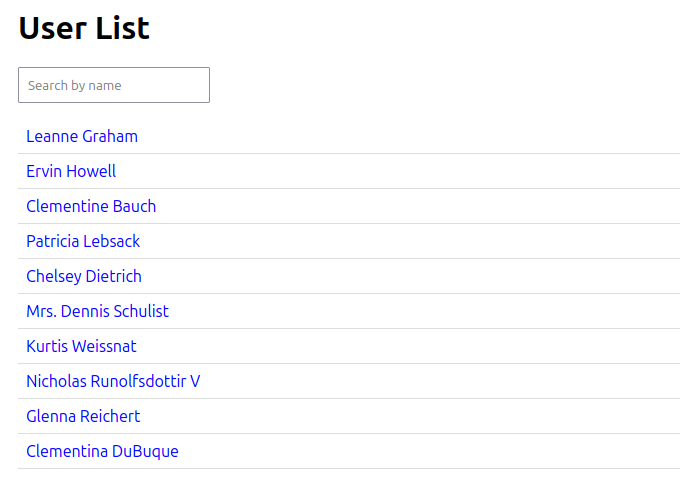
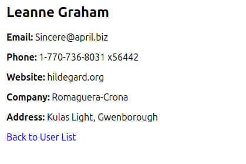

 ## DEMO:



```
.
├── react-js
│   ├── package.json
│   ├── package-lock.json
│   ├── public
│   │   ├── favicon.ico
│   │   ├── index.html
│   │   ├── logo192.png
│   │   ├── logo512.png
│   │   ├── manifest.json
│   │   └── robots.txt
│   ├── README.md
│   └── src
│       ├── App.css
│       ├── App.js
│       ├── App.test.js
│       ├── components
│       │   ├── UserDetails.js
│       │   └── UsersList.js
│       ├── index.css
│       ├── index.js
│       ├── logo.svg
│       ├── reportWebVitals.js
│       └── setupTests.js
└── vanilla-js
    ├── css
    │   └── styles.css
    ├── index.html
    └── js
        └── app.js
```